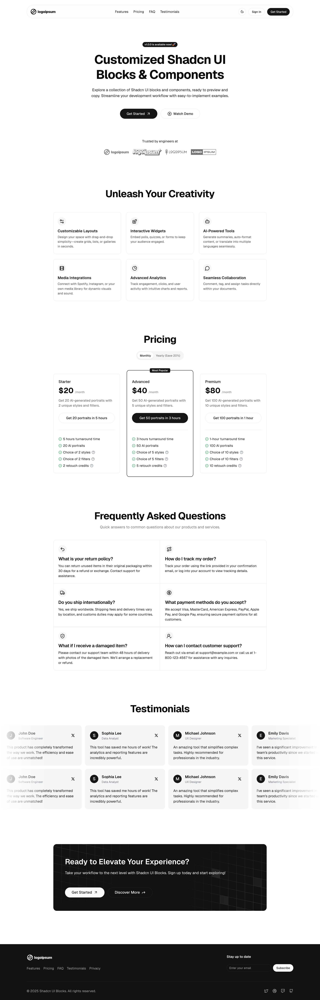

# Finvoras - Personal Finance Management Website

A modern, responsive website for Finvoras personal finance app built with Next.js, Tailwind CSS, and Shadcn UI.

## About Finvoras

Finvoras is a personal finance management app that helps young people and families track expenses, manage budgets, and understand financial health.

## Preview



## Features

- 🎨 Modern and clean design
- 📱 Fully responsive layout
- 🎯 Built with Next.js 15
- 💅 Styled with Tailwind CSS `3.4` & `4.0`
- 🧩 Built with [Shadcn UI](https://ui.shadcn.com) and [Shadcn UI Blocks](https://shadcnui-blocks.com)
- 🌙 Dark mode support
- 🔐 Authentication system (Login/Register)
- 📰 Blog system for financial education
- 💰 Financial content and resources

## Getting Started

1. Clone the repository:

```bash
git clone https://github.com/hoangsang17th/finvoras.com.git
cd finvoras.com/finvoras-website
```

2. To use Tailwind CSS v4.0:

- Ensure you’re using Node.js 20 or higher.
- Switch to the tailwind-v4 branch:

```bash
git checkout tailwind-v4
```

3. Install dependencies:

```bash
npm install
```

4. Start the development server:

```bash
npm run dev
```

5. Open [http://localhost:3000](http://localhost:3000) in your browser to see the result.

## Pages Structure

- **Home** (`/`) - Landing page with hero, features, pricing, etc.
- **Blog** (`/blog`) - Financial education blog listing
- **Blog Post** (`/blog/[slug]`) - Individual blog post view  
- **Login** (`/login`) - User authentication
- **Register** (`/register`) - User registration

## Customization

1. **Content**: Update hero section, features, and pricing in respective components
2. **Blog**: Replace mock data in `lib/data/blog.ts` with your CMS/API
3. **Branding**: Update logo, colors, and styling in Tailwind config
4. **Authentication**: Connect auth forms to your backend API

## About Finvoras

Finvoras helps young people and families take control of their finances through:

- Expense tracking and budget management
- Financial education via blog content
- User-friendly interface for financial planning
- Community-driven financial literacy

## Contributing

If you have any suggestions or improvements, please create an issue or submit a pull request.
